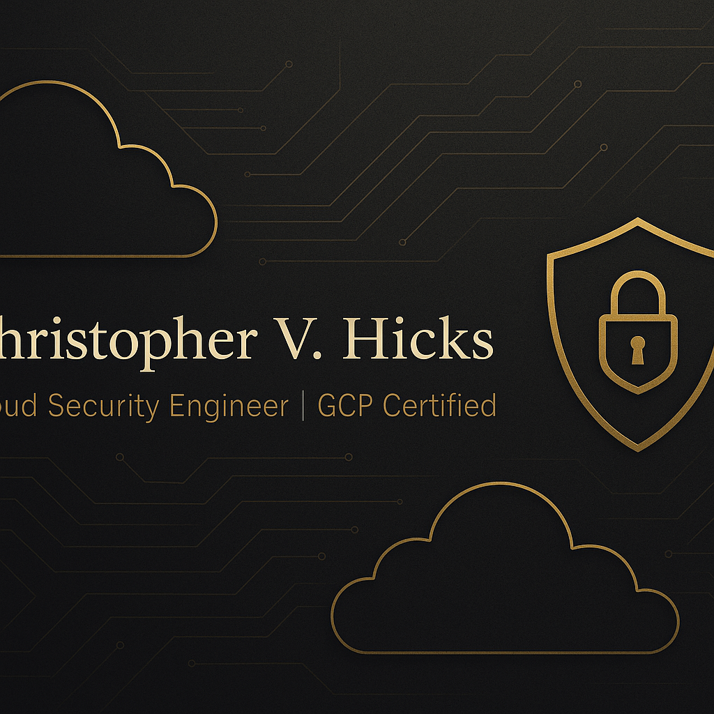

# 👋 Hey, I'm Chris Hicks

💻 Cloud Engineer | ⚡️ GCP, Terraform, Python 
💻 Certified Cloud Security Engineer 
🔐 Focused on Cloud Security, Zero Trust, SIEM pipelines  
🎯 Mission: Build secure, scalable cloud systems for modern business

## 🔧 My Top Projects
- **[CloudSentinel](https://github.com/chrisclouds323/CloudSentinel)** — Threat detection pipeline w/ Slack alerts  
- **CloudGuard Vault** — Secret management on GCP with Zero Trust

## 🛠️ Tech I Use

## 📫 Let's Connect
[LinkedIn](https://www.linkedin.com/in/chris-hicks-ba8765337/) • [CHE Security Solutions](https://chrisclouds323.github.io)

---
